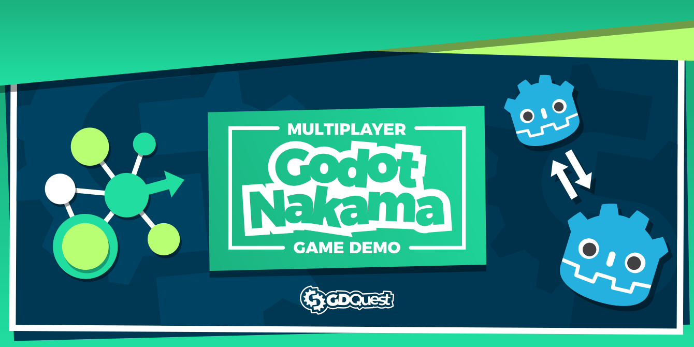
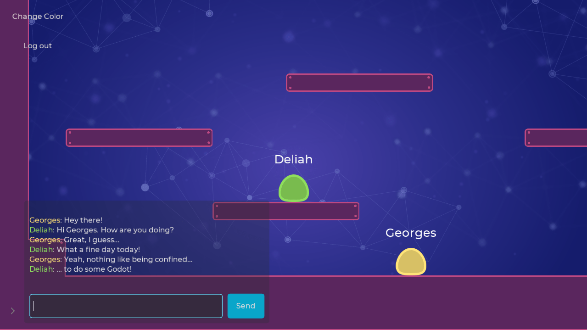
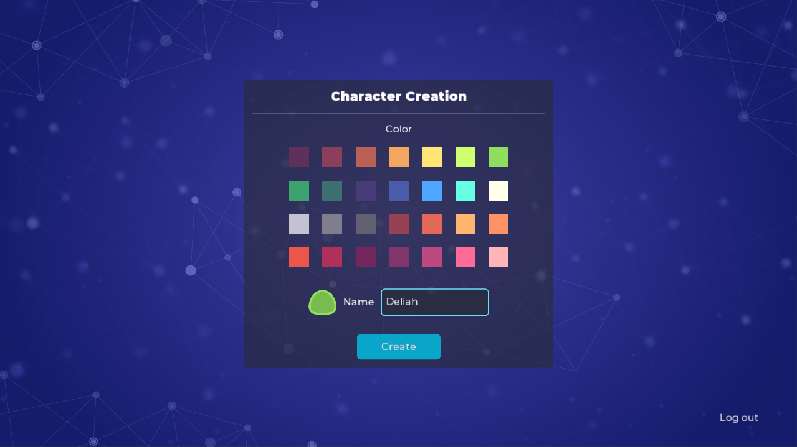

# Nakama Godot Demo

This demo shows how to use [Nakama](https://heroiclabs.com/) with the [Nakama Godot client](https://github.com/heroiclabs/nakama-godot).

It showcases the following Nakama features:

- Authentication, sessions, and disconnection.
- [Game storage](https://heroiclabs.com/docs/storage-collections/).
- Sockets and managing connections.
- [Real-time chat](https://heroiclabs.com/docs/social-realtime-chat/).
- In-app [notifications](https://heroiclabs.com/docs/social-in-app-notifications/) with popups.
- Character color customization.
- Platforming mechanics and synchronizing players. Multiple players can interact together.

It also shows good practices to design user interface and structure your Godot projects.

## Learning Nakama

There are two Godot projects in this repository:

1. In the `godot/` directory, you have the complete demo.
2. In the `tutorial/` directory, there is a Godot project showing basic code examples to get you started. There, you will also find written notes for an upcoming series of video tutorials, with code snippets.

## Screenshots

Here is a view of the game world, where players can chat, move around, interact with one-another, or change their color.

The character creation screen allows you to pick a color from a predefined color palette.

## Testing the project

To test the project, you need first to install the server and get it running, then run two instances of Godot.

To install and start the server:

1. Install Docker.
   - [On Windows 10 Pro](https://docs.docker.com/docker-for-windows/install/).
   - [On Windows 10 Home (and below)](https://github.com/heroiclabs/nakama-godot-demo#setting-up-docker-on-windows-10-home-and-below).
   - [On Mac](https://docs.docker.com/docker-for-mac/install/).
   - [On Ubuntu](https://docs.docker.com/engine/install/ubuntu/): `sudo apt install docker.io docker-compose`.
1. Open your terminal and navigate to the `nakama/` directory.
1. Run the command `docker-compose -f docker-compose.yml up` or run `boot.bat` in Windows.

Docker should automatically download, then install Nakama and CockroachDB for you before starting the local server. The server should emit the message "Startup done".

Then, to test the project in Godot, you need to open or run the project in the `godot/` directory in two separate instances.

### Setting up docker on Windows 10 Home and below)

1. [Install Docker Toolbox](https://github.com/docker/toolbox/releases).
2. Double-click on the Docker Quickstart Terminal shortcut created by the docker toolbox installer.
3. Run the Command `docker-machine ip` to get your IP and save it for future use.
4. Extra settings if not running project from C drive

   1. [Create shared folder](https://docs.docker.com/toolbox/toolbox_install_windows/#optional-add-shared-directories)
   2. Edit in the `docker-compose.yml` change the volumes path under nakama services to

   "/**Folder Name define in the VBox settings(step 4i)**/**path to docker-compose.yml file**:/nakama/data"

   3. Run the Command "docker-machine restart"

### Registering and logging in

To log into the game, you need first to register a dummy local account. To do so, on the initial game screen:

1. Click on the "register" button.
2. Enter any email and password.
   - The email doesn't need to exist, but it needs to be of the form `email@domain.extension`. For example, `test@test.com` would work.
   - The password needs to contain at least 8 characters.

Once you registered an account, you can log in, create a new character, and enter the game.

## Using the Nakama admin area

Nakama's server provides a web admin interface to see, modify, or purge users and other game data. To access it:

1. Start the Nakama server.
1. Navigate to http://127.0.0.1:7351/ in your web browser.
   - Run `docker-machine ip` to get the IP if Windows 10 Home and below
1. Log into the platform. The default admin user's login is `admin` and its password is `password`.

## Licenses

This project is dual-licensed:

- The source code is available under the Apache 2.0 license.
- Art assets (images, audio files) are [CC-By-SA 4.0](https://creativecommons.org/licenses/by-sa/4.0/). You should attribute them to Heroic Labs (https://heroiclabs.com/).
